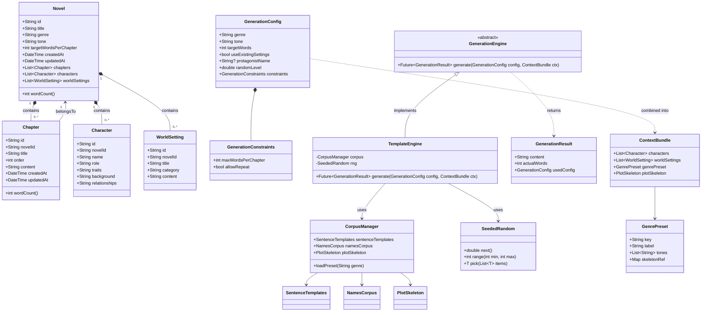
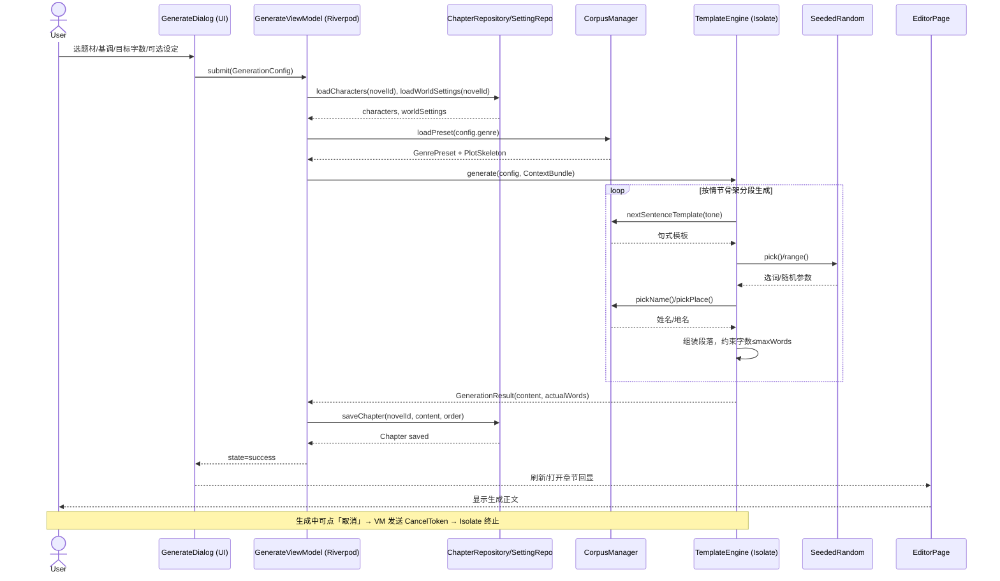
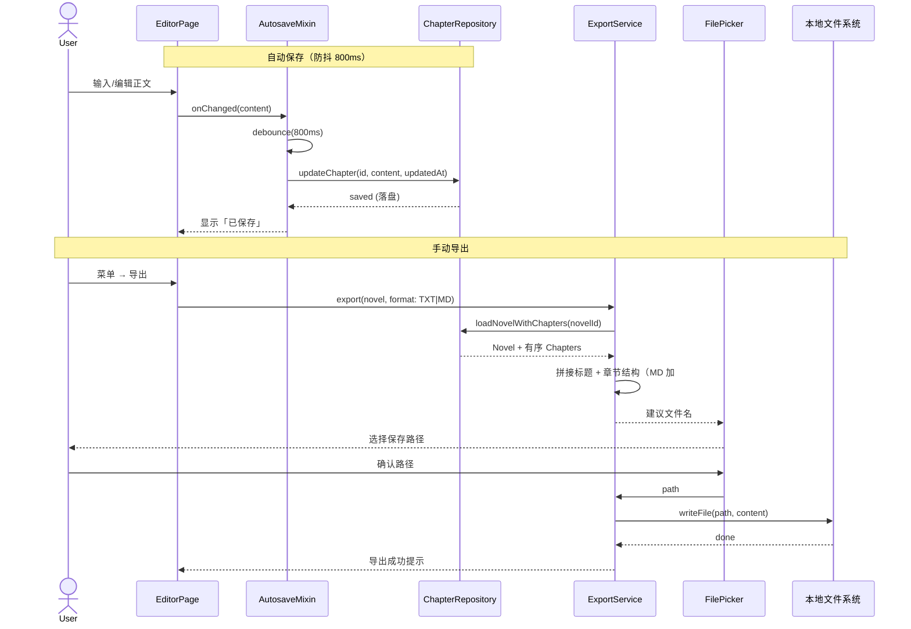

# 墨匠 / InkSmith — MVP 系统架构设计 + 任务分解

| 项目 | 内容 |
| --- | --- |
| 文档类型 | 架构设计 + 任务分解（Architect 产出） |
| 架构师 | 高见远（Gao / software-architect） |
| 版本 | MVP v0.1 |
| 技术栈裁定 | Flutter（Dart）单代码库，完全离线，零外部 API |
| 日期 | 2026-07-31 |

> 本文档配合 `prd-mvp.md` 使用。所有设计遵循主理人齐活林裁定：Flutter/Dart 单代码库、完全离线、模板/规则/语料生成引擎（可插拔，P2 再接本地大模型）、不做云同步、Hive/SQLite 本地存储、内置中文网文题材预设、单章上限 20000 字、无版权风险语料。

---

## 1. 实现方案 + 框架选型

### 1.1 技术难点分析

| 难点 | 说明 | 对策 |
| --- | --- | --- |
| 离线可控生成 | 无大模型、无网络，需用模板/语料组合出连贯中文正文 | 可插拔 `GenerationEngine` 抽象 + `TemplateEngine` 实现，句式模板 + 情节骨架 + 语料选词 + 可控随机 |
| 生成期间 UI 不卡顿且可取消 | 单章上限 20000 字，纯 Dart 同步生成会阻塞主线程 | 引擎在 **Isolate** 中运行，`generate` 返回 `Stream<GenerationProgress>` 或 `Future` + `CancelToken`，UI 显示进度与「取消」 |
| 结构化创作联动 | 角色/世界观需被引擎读取并影响正文 | `ContextBundle` 聚合 Novel 的角色/世界观 + 题材预设 + 情节骨架，作为输入传给引擎 |
| 跨端一致 + 零网络 | 同一套项目文件在 Win/Android/iOS 间迁移 | 纯本地 Hive 存储；项目导出为**单一可移植归档**（见待明确事项 4），文件交换而非云同步 |
| 自动保存不丢稿 | 崩溃后可恢复 | 防抖 800ms 写 Hive；写入即落盘；编辑器显示「已保存」状态 |

### 1.2 框架与库选型（含理由）

| 关注点 | 选型 | 版本建议 | 理由 |
| --- | --- | --- | --- |
| UI 框架 | **Flutter** (Dart) | Flutter 3.24+ / Dart 3.5+ | 单代码库跨 Win/Android/iOS，PRD 裁定 |
| 状态管理 | **flutter_riverpod** | ^2.5 | 比 Bloc 更轻、可测试（`Provider`/`StateNotifier` 即 ViewModel），无需大量模板代码 |
| 路由 | **go_router** | ^14.2 | 声明式路由，天然支持多端深链、URL 路由，便于首页↔项目内导航 |
| 本地存储 | **Hive + hive_flutter** | hive ^2.2 / hive_flutter ^1.1 | Dart 原生、零原生依赖、性能高、适合离线；类型用 `hive_generator` 自动生成 Adapter |
| 文件路径 | **path_provider** | ^2.1 | 获取各平台 App 文档/支持目录（存储项目数据） |
| 导出选路径 | **file_picker** | ^8.0 | 让用户自选 TXT/MD 保存位置（可写目录权限） |
| 实体 ID | **uuid** | ^4.4 | 各实体用 uuid v4 字符串主键 |
| 值对象辅助 | **equatable** | ^2.0 | 模型/配置 `==`/`hashCode` 简化（可选，轻量） |
| 构建工具 | **build_runner + hive_generator** | dev | 生成 Hive TypeAdapter |

> 说明：MVP 导出自建 TXT/Markdown 字符串，**不引入** markdown 解析/渲染库（P1 再做 EPUB 时再加 `epub` 包）。不引入任何网络库（`http`/`dio` 一律不用），从依赖层面杜绝联网。

### 1.3 架构风格

- **分层（feature-first + clean-ish）**：`models`(实体) → `storage`(仓库/数据源) → `engine`(生成引擎，独立可测) → `features`(UI 按功能分模块) → `core`(路由/主题/DI/常量/错误)。
- **依赖方向**：UI → (ViewModel/Provider) → Repository / Engine；Repository → Hive；Engine → Corpus。UI 不直接碰 Hive。
- **生成引擎可插拔**：`GenerationEngine` 抽象接口，MVP 仅 `TemplateEngine` 实现；P2 新增 `LocalLlmEngine` 实现同一接口即可替换，UI 层无感。
- 引擎与 UI 解耦，便于独立单测（引擎纯函数 + 注入 `CorpusManager`/`SeededRandom`）。

---

## 2. 文件列表及相对路径

```
novel-writer/
├── pubspec.yaml                         # 依赖与构建配置（见第6节）
├── analysis_options.yaml                # lint 规则
├── lib/
│   ├── main.dart                        # 应用入口（runApp + Hive 初始化）
│   ├── app.dart                         # App 根组件 + ProviderScope + 路由挂载
│   ├── core/
│   │   ├── constants/
│   │   │   ├── app_constants.dart       # 路径、默认上限(20000)、防抖时间等常量
│   │   │   └── genre_presets.dart       # 内置中文网文题材预设（玄幻/都市/科幻/言情/悬疑…）
│   │   ├── errors/
│   │   │   └── app_exceptions.dart      # AppException 体系 + Result 封装
│   │   ├── router/
│   │   │   └── app_router.dart          # go_router 路由表
│   │   ├── theme/
│   │   │   └── app_theme.dart           # Material 3 主题（深色/浅色）
│   │   └── di/
│   │       └── providers.dart           # Riverpod 全局 Provider（repo/engine 单例注入）
│   ├── models/
│   │   ├── novel.dart                   # Novel 项目实体
│   │   ├── chapter.dart                 # Chapter 章节实体
│   │   ├── character.dart               # Character 角色实体
│   │   ├── world_setting.dart           # WorldSetting 世界观实体
│   │   └── generation_config.dart       # GenerationConfig + GenerationConstraints
│   ├── storage/
│   │   ├── app_database.dart            # Hive 初始化 + Box 注册（含 TypeAdapter 注册）
│   │   ├── novel_repository.dart        # 项目 CRUD + 聚合加载
│   │   ├── chapter_repository.dart      # 章节 CRUD + 排序 + 自动保存
│   │   └── setting_repository.dart      # 角色/世界观 CRUD
│   ├── engine/
│   │   ├── generation_engine.dart       # 抽象接口 GenerationEngine + GenerationResult + ContextBundle
│   │   ├── template_engine.dart         # TemplateEngine 实现（MVP 默认引擎）
│   │   ├── corpus/
│   │   │   ├── corpus_manager.dart      # 语料加载/调度（按题材取模板/骨架/选词）
│   │   │   ├── sentence_templates.dart  # 句式模板库（含章末钩子/爽点/对话占比规则）
│   │   │   ├── names_corpus.dart        # 姓名/地名/势力语料（自研/公有领域）
│   │   │   └── plot_skeleton.dart       # 情节骨架（起承转合/章节推进节点）
│   │   ├── random/
│   │   │   └── seeded_random.dart       # 可控随机（种子化，支持 randomLevel）
│   │   └── constraints/
│   │       └── generation_constraints.dart # 约束控制（单章字数上限、重复抑制）
│   ├── features/
│   │   ├── project_list/
│   │   │   ├── project_list_page.dart   # 首页：项目列表 + 新建/打开/重命名/删除
│   │   │   └── project_list_viewmodel.dart
│   │   ├── workspace/
│   │   │   ├── workspace_page.dart      # 项目内主界面（三栏布局）
│   │   │   ├── chapter_list_panel.dart  # 左栏：章节列表 + 增删/拖拽排序
│   │   │   └── setting_panel.dart       # 右栏：角色/世界观编辑 + 一键生成入口
│   │   ├── editor/
│   │   │   ├── editor_page.dart         # 中间：章节正文编辑 + 自动保存
│   │   │   └── autosave_mixin.dart      # 防抖自动保存逻辑
│   │   ├── generate/
│   │   │   ├── generate_dialog.dart     # 一键生成弹窗（题材/基调/字数/设定/随机度）
│   │   │   └── generate_viewmodel.dart  # 调用引擎 + 进度/取消 + 落库
│   │   └── export/
│   │       ├── export_service.dart      # TXT/Markdown 拼接与写文件
│   │       └── export_page.dart         # 导出菜单/对话框
│   └── widgets/
│       └── common.dart                  # 通用小组件（空态/加载/已保存指示等）
├── test/                                # 单元/组件测试（engine + repository 为主）
├── windows/ android/ ios/               # Flutter 生成的多端运行器与配置（flutter create 产出）
└── README.md
```

---

## 3. 数据结构和接口（类图）



**接口契约要点**
- `GenerationEngine.generate(config, ctx)`：**必须纯离线、可取消、必返回 `GenerationResult`**；`content` 字数必须 ≤ `config.constraints.maxWordsPerChapter`（默认 20000）。
- `ContextBundle` 由 ViewModel 在调用前聚合（角色+世界观+题材预设+情节骨架），引擎只读不改。
- `SeededRandom` 由 `randomLevel`（0=保守，1=随机）映射随机性，保证「可控随机」与可复现（同种子同输出，便于重生成调试）。

---

## 4. 程序调用流程（时序图）

### 4.1 一键生成主流程



### 4.2 自动保存 + 导出流程



---

## 5. 任务列表（有序、含依赖，按实现顺序）

> 按 SOP 硬性上限拆为 **5 个任务**，每个任务 ≥3 个文件、按模块分组；T01 为项目基础设施。工程师可在此框架内进一步细化子步骤。

| 任务ID | 任务名 | 源文件（来自第2节） | 依赖 | 优先级 |
| --- | --- | --- | --- | --- |
| **T01** | 项目基础设施与骨架 | `pubspec.yaml`、`lib/main.dart`、`lib/app.dart`、`lib/core/router/app_router.dart`、`lib/core/theme/app_theme.dart`、`lib/core/di/providers.dart`、`lib/core/constants/app_constants.dart`、`lib/core/errors/app_exceptions.dart` | 无 | P0 |
| **T02** | 数据模型与本地存储层 | `lib/models/novel.dart`、`lib/models/chapter.dart`、`lib/models/character.dart`、`lib/models/world_setting.dart`、`lib/models/generation_config.dart`、`lib/storage/app_database.dart`、`lib/storage/novel_repository.dart`、`lib/storage/chapter_repository.dart`、`lib/storage/setting_repository.dart` | T01 | P0 |
| **T03** | 可插拔生成引擎 | `lib/engine/generation_engine.dart`、`lib/engine/template_engine.dart`、`lib/engine/corpus/corpus_manager.dart`、`lib/engine/corpus/sentence_templates.dart`、`lib/engine/corpus/names_corpus.dart`、`lib/engine/corpus/plot_skeleton.dart`、`lib/engine/random/seeded_random.dart`、`lib/engine/constraints/generation_constraints.dart`、`lib/core/constants/genre_presets.dart` | T02 | P0 |
| **T04** | 核心功能 UI（项目/编辑器/生成） | `lib/features/project_list/*`、`lib/features/workspace/*`、`lib/features/editor/*`、`lib/features/generate/*` | T02, T03 | P0 |
| **T05** | 导出与集成收尾 | `lib/features/export/export_service.dart`、`lib/features/export/export_page.dart`、`lib/widgets/common.dart`、平台配置（`windows/`、`android/`、`ios/`）与构建校验 | T02, T04 | P0 |

**实现顺序说明**：T01 搭好运行骨架 → T02 定义实体与落库（引擎与 UI 的共同依赖）→ T03 实现生成引擎（依赖模型）→ T04 把引擎与存储接到 UI → T05 完成导出并做整体联调与多端构建配置。

---

## 6. 依赖包列表（pubspec.yaml 关键项）

```
dependencies:
  flutter:
    sdk: flutter
  flutter_riverpod: ^2.5.1      # 状态管理（Provider / StateNotifier 即 ViewModel）
  go_router: ^14.2.7            # 声明式路由（首页 ↔ 项目内）
  hive: ^2.2.3                  # 本地 NoSQL 存储（项目/章节/设定）
  hive_flutter: ^1.1.0          # Hive 的 Flutter 集成（初始化/Box 监听）
  path_provider: ^2.1.3         # 获取各平台 App 文档/支持目录
  file_picker: ^8.0.0           # 导出时让用户自选保存路径
  uuid: ^4.4.0                  # 实体主键（uuid v4）

dev_dependencies:
  flutter_test:
    sdk: flutter
  build_runner: ^2.4.11         # 代码生成运行器
  hive_generator: ^2.0.1        # 生成 Hive TypeAdapter
  equatable: ^2.0.5             # 模型值相等（可选轻量）
```

> 不引入 `http`/`dio` 等任何网络库，从依赖层面保证「零网络请求」。

---

## 7. 共享知识（跨文件约定）

- **命名规范**：文件名 `snake_case`，类名 `PascalCase`，Provider/ViewModel 以 `ViewModel`/`Notifier`/`Provider` 后缀；常量集中放 `core/constants`。
- **错误处理**：统一 `AppException`（子类：`StorageException`/`EngineException`/`ExportException`）；Repository/Engine 返回 `Result<T>` 或抛 `AppException`，UI 用 SnackBar 提示，**生成失败不得让 App 崩溃**。
- **文件路径约定**：项目数据存 `path_provider` 的 `applicationSupportDirectory`（各平台隔离）；导出由 `file_picker` 让用户选目录，文件名默认 `<项目名>_<时间戳>.txt/.md`。
- **生成引擎契约**：`generate(config, ctx)` 必须（1）纯离线、（2）可被 `CancelToken` 取消、（3）`content` 字数 ≤ `constraints.maxWordsPerChapter`（默认 20000）、（4）返回真实 `actualWords`。实现类须注入 `CorpusManager` 与 `SeededRandom` 以便单测。
- **自动保存策略**：编辑器 `onChanged` 后防抖 **800ms** 写 Hive（落盘即存），显示「已保存」；不阻塞输入；章节 `content` 整体覆盖写（MVP 不做增量 diff）。
- **ID 与字数**：所有实体 `id` 用 `uuid` v4；中文字数统计统一用 `countWords(String)`（CJK 字符计 1，连续 ASCII 单词计 1），模型 `wordCount()` 复用之。
- **仓库单一数据源**：UI 仅通过 Repository / Riverpod Provider 读写；引擎只读 `ContextBundle`，不直连 Hive。
- **差异约定**：引擎在 Isolate 运行，`GenerateViewModel` 持有 `CancelToken`，取消时终止 Isolate 并丢弃中间结果。

---

## 8. 待明确事项（技术聚焦，避免与 PRD 待确认重复）

1. **存储最终选型**：推荐 Hive（Dart 原生、零原生依赖、简单）；若团队更看重复杂查询/事务一致性，可换 `sqflite`。需确认，影响 `storage/` 与 TypeAdapter 代码生成方式。
2. **生成取消/并发的 Isolate 策略**：单章 20000 字纯 Dart 同步生成会卡 UI，建议引擎跑在独立 `Isolate` 并通过 `SendPort`/`CancelToken` 取消；是否采用 Isolate + 进度流（`Stream<GenerationProgress>`）需确认（影响 `generate` 签名）。
3. **大章节自动保存粒度**：20k 字每次落盘开销需评估；是否改为「仅保存变更段落」或「分块 Box」？MVP 先整体防抖覆盖，确认是否够用。
4. **跨端项目迁移格式**：PRD 强调「同一套本地项目文件在 Win/Android/iOS 间可迁移」。需定义**单一可移植归档**（建议 `.json` 或 `.zip` 内含 Hive 导出），供文件交换；这影响 `export/` 与未来「导入」。
5. **状态管理最终拍板**：推荐 Riverpod；若团队规范偏好 Bloc，需提前定，影响所有 `*_viewmodel.dart` 写法。
6. **Hive TypeAdapter 代码生成**：采用 `build_runner` 自动生成 vs 手写 Adapter，需确认（影响 CI/构建步骤）。
7. **题材预设语料体量基线**：各内置题材（玄幻/都市/科幻/言情/悬疑）至少需多少句式模板/情节骨架/姓名地名，方能「开箱即用」达到基本连贯？需定最小语料规模，避免 MVP 生成质量过低。

---

*文档结束 — 高见远 / 架构设计 MVP v0.1 / 2026-07-31*
